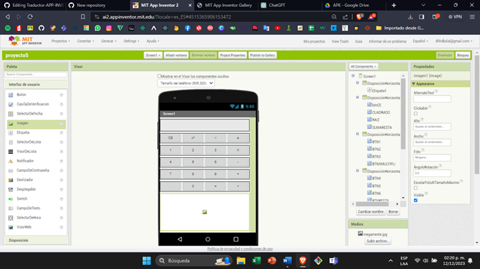
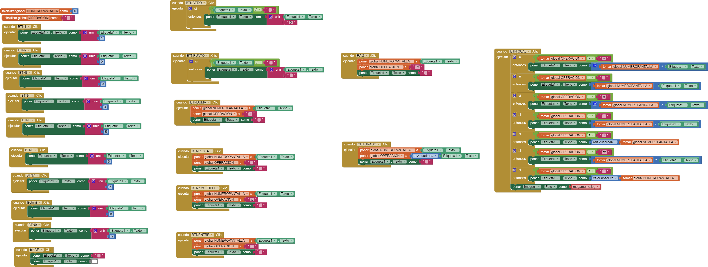

# PROYECTO 4: CALCULADORA

## OBJETIVO

El objetivo de este proyecto es desarrollar una calculadora funcional con las siguientes operaciones: suma, resta, multiplicación, división, potenciación, raíz cuadrada y manejo de puntos decimales.

## COMPONENTES

1. **Etiqueta del resultado:** Este componente muestra el resultado de las operaciones realizadas en la calculadora.

2. **Números 4, 5 y 6 junto con la función restar:** Se emplean los números 4, 5 y 6 para realizar operaciones de resta.

3. **Otro componente que muestra los números 7, 8, 9 y la función sumar:** Permite operar con los números 7, 8 y 9, además de realizar sumas.

4. **Componente adicional que muestra la función "punto cero igual" y la operación de división:** Presenta la función "punto cero igual" y permite llevar a cabo operaciones de división.

5. **Componente de imagen:** Representa visualmente algún elemento gráfico en la interfaz de la calculadora.

## BLOQUES

### Funcionamiento de los bloques

Cada botón representa un número o una operación matemática según su etiqueta correspondiente (1-9). Estos botones añaden los dígitos a la pantalla de la calculadora. Se pueden realizar operaciones básicas (suma, resta, multiplicación, división) con estos números. Existe un botón para limpiar la pantalla y reiniciar la operación.

## LINK DE GALERIA
<a href="https://gallery.appinventor.mit.edu/?galleryid=26d1fa8c-5eed-4239-ace2-6b4b7da5db06" style="text-decoration: none; display: inline-block; padding: 10px 20px; border: 2px solid #555; border-radius: 5px; background-color: #007bff; color: #fff; font-size: 16px;" rel="noopener">
  GALERÍA
</a>

## link de APK
<a href="https://drive.google.com/file/d/1sRyzDZdCrmK5Y2iMR0BLCBzIufcC2fic/view?usp=sharing" style="text-decoration: none; display: inline-block; padding: 10px 20px; border: 2px solid #555; border-radius: 5px; background-color: #007bff; color: #fff; font-size: 16px;" rel="noopener">
  APK
</a>

